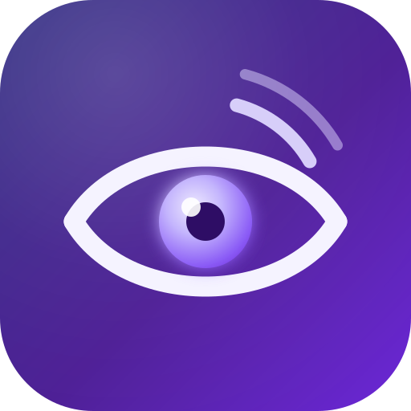
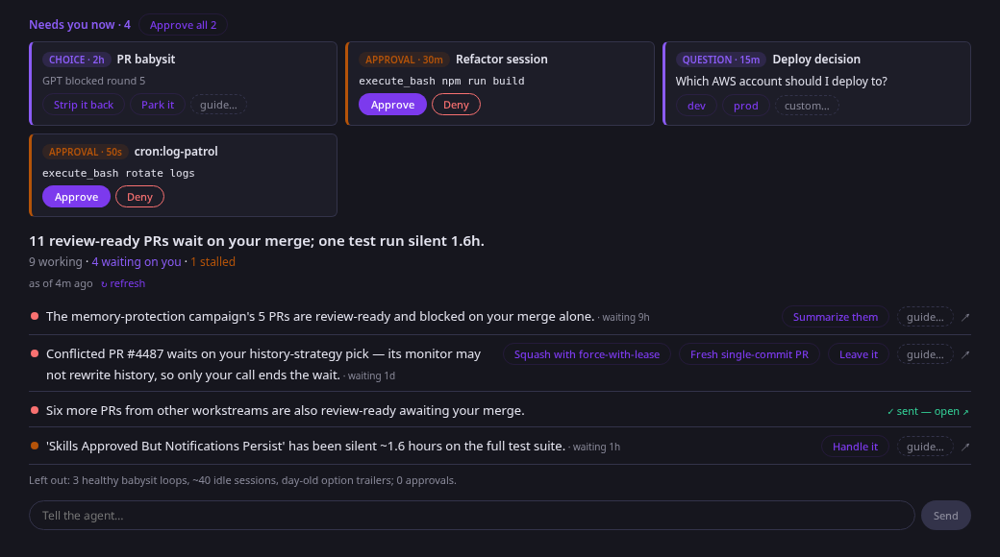
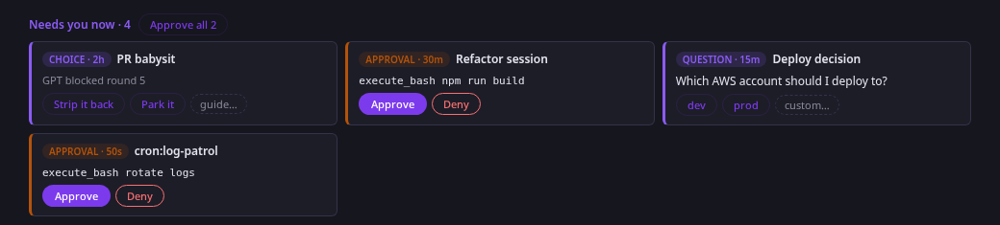

<p align="center">
  
</p>

# Glance

**The agent reads, you glance.** A KiroCrew app that replaces session-board
scanning with an agent-curated brief.



An LLM curator cron triages everything in flight on your KiroCrew host every
15 minutes and writes a short prioritized brief — what needs you *now*, what
needs you *soon*, what resolved while you were away — each item with one
suggested action. The UI is a single screen:

1. **Live blockers** — pending questions, approvals, and plan gates, polled
   directly and answerable inline (these must never be stale).
2. **The brief** — the curator's judgment in plain language. One click
   delegates any item back to an agent.
3. **One text line** — tell the agent anything; each message starts its own
   fresh background session.



No sections to scan, no filters, no keyboard nav — v2 deleted the ~400 lines
of client-side heuristics that approximated judgment, because the curator has
the real thing. See `DESIGN.md` for the paradigm and architecture.

## Install

```bash
git clone https://github.com/rubencu/kirocrew-glance
kirocrew app install ./kirocrew-glance
kirocrew config set agent.apps_trusted '["glance"]'
kirocrew app enable glance
```

Open the dashboard → Glance. The curator cron registers with the app; hit
"Write the first brief" instead of waiting for the first 15-minute tick.

## Tests

```bash
node --test tests/            # pure-logic unit tests
bash tests/run-render-test.sh # SSR render smoke (self-skips without a React host)
```
